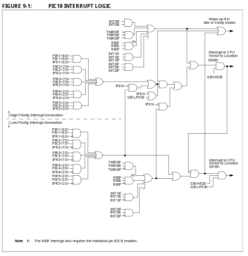
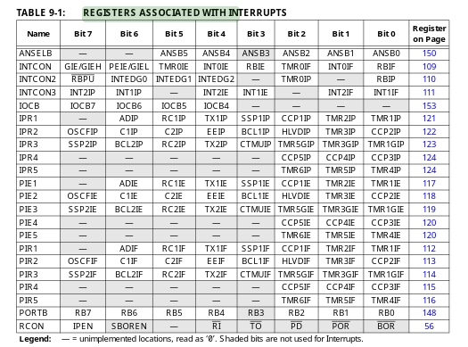

## Interrupcions

---

#### Per que volem interrupcions?

Moltes vegades ens interesarà gestionar certs events que passin al nostre microcontrolador, principalment d'entrada i sortida. El computador té una limitació d'execució, només s'executa una intrucció a la vegada, i és a la que apunta el **PC**. Per tant, si volem detectar aquests events en *temps real* hem de fer el que es coneix com a **espera activa**, es a dir, un bucle on comprovem  els valors que ens interessin constantment. Per això, el microprocessador ens ofereix una solució implementada mitjantçant *hardware*. 

#### Com funciona una interrupció?

Cada interrupció té associats **3 bits principals**, que estan emmagatzemats en registres especials del microprocessador.

+ **IE**: Interruption Enable: Especifica si la interrupcio està activada

+ **IF**: Interruption Flag: Val 1 quan hi ha una interrupció

+ **IP**: Interrupction Priority: Especifica la prioritat de la interrupció.

Quan el bit **IF** d'una interrupció pren valor 1, s'interromp la execució i el **PC** apunta a on està el codi que controla les interrupcions. En el nostre microprocessador trobem que una interrupció pot ser de prioritat alta o baixa. El codi en assemblador que controla les interrupcions de alta prioritat es troba a partir de la posició de memoria **0x08** i el de les de baixa prioritat a **0x18**. Si es necessita més espai per a gestionar les interrupcions es pot cridar a funcions que estiguin a qualsevol lloc de memoria. 

Per a que el CiruitLogicCombinacional que gestiona les interrupcions funcioni com nosaltres volguem hem de configurar certs registres del microprocessador. Si fem un seguiment de que passa amb cada bit a les portes logiques ens adonem facilment de que vol dir cada un.

+ **GIE (Global interrupt enable)**: Habilita les interrupcions (podem veure que al final sempre tenim una and amb aquest bit, si val 0 no interrupim mai)

+ **GIEL (Global interrucpt enable Low**: Habilita les interrupcions de baixa prioritat (podem veure que al final  de les de baixa prioritat tenim una and amb aquest bit, si val 0 no interrupim mai)

+ **IPEN (Interrupt priority enable)** Habilita les prioritat (veiem que si IPEN = 0, loes interrupcions de baixa prioritat son tractades com de alta prioritat)

Per saber on trobar aquests bits tenim aquesta taula, que ens diu en quins registres trobarlos. Per assignar el seu valor podem utilitzar les instruccions **BTFSC (bit file set clear) i BTFSS (bit file set set)**:

La prioritat d'una interrupció resulta en que mai es tractara una interrupció de baixa prioritat si n'hi ha una de alta prioritat per tractar (veiem que en el CLC la sortida que interrucpeix esta conectada negada amb el final de les interrucions de baixa prioritat en una AND. Si val 1, no interrumpirem de baixa prioritat) . En resum el CLC que tracta les interrupcions té dos sortides principals

+ Interrumpir el codi d'execucio i saltar a tractament de alta prioritat: **PC = 0x08**

+ Interrumpir el codi d'execució i saltar a tractament de baixa prioritat: **PC = 0x18**

Quan es produeix una interrupció s'ha de gestionar d'alguna manera que no es tracti una altra interrupció, ja que podria causar problemes. Per tant quan interrumpim, el bit **GIE (en cas de les de alta prioritat)/GIEL (en cas de baixa prioritat)** passa a valdre 0 mentre es tracta la intrucció. Per tant podem veure que si interrumpim, i despres arriben dos interrupcions, primer una de baixa i despres una de alta, quan s'acabi de tractar i **GIE** torni a valdre 1, per la **lògica del CLC** tractarem primer la de alta prioritat, i despres la de baixa.

En acabar el tractament de la interrupció hem de tornar a la intrucció a la que estavem. La intrucció **RETFIE** ens ho fa: **PC = PC(abans de la interrupció).** A més, dins del codi que tracta la interrupció hem de posar el **IF (interrupt flag)** a **0** ja que la interrució ha estat tractada, sino estariem en un bucle infinit tractant la interrupció continuament.

Una altre tema a tenir en compte és que el codi que s'estava executant tenia com a premisa que els registres **WREG, STATUS i BSR** no canvien si no els modica una intrucció. Per tant, per que el programa segueixi funcionant quant acabem de tractar la interrupció hem de deixar aquests registres tal i com estaven. Per al cas de les interrupcions de alta prioritat en tenim prou amb fer un **RETFIE FAST**, que copia als registres una copia que havia fer el microprocessador quan ha saltat la interrupció (només si la interrupció es de altat prioritat). Si gestionem interrupcions de baixa priortat hem de salvar i restaurar aquest registres manualment (mitjançant instruccions).
