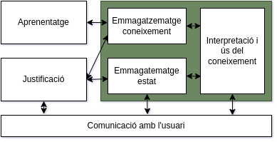

# Resum final

---

## 1. Representació del coneixement

### 1. 1 Introducció

Primer de tot hem de distingir entre:

+ **Informació** :arrow_right: Conjunt de dades sense interpretar.

+ **Coneixement** :arrow_right:  Dades que modeles de forma estructurada la experiència que es té sobre el domini.

**Esquema de representació** :arrow_right: Instrument per a codificar la realitat de un ordinador. Té dues parts:

+ **Estàtica** :arrow_right: Estructura de dades i operacions. Predicats.

+ **Dinàmica** :arrow_right: Dades de coneixement. Procediments

<u>**Incomplitud de la representació del coneixement**</u>

La nostra representació sempre es incompleta perquè:

+ el mon canvia constantment :arrow_right: **Modificacions**

+ hi ha massa coneixement a representar :arrow_right: **Volum**

+ la realitat té moltíssims detalls :arrow_right: **Complexitat**

<u>**Tipus de coneixement**</u>

+ **Declaratiu** :arrow_right: Independent del seu ús. Que és, no com s'utilitza.

+ **Procedimental** :arrow_right: Inclou informació de com s'utilitza

### 1. 2 Enginyeria del coneixement per als *SBC*s

<u>**Sistemes experts**</u> :arrow_right: Es busca emular la capacitat de resolució dels experts humans. Basat en sistemes de regles de producció.

<u>**Sistemes basats en el coneixement**</u> :arrow_right: Utilitzar el coneixement del domini per a solucionar problemes. Tenen capacitat de aprenentatge.

+ **Característiques:** S'apliquen per a resoldre problemes complexos on els sistemes convencionals no son suficients. 

+ **Components:**
  
  

<u>***SBC*s basats en sistemes de producció**</u>

+ Raonament basat en motor de inferència. 

+ Coneixement del domini :arrow_right: **Ontologia**

+ Coneixement de resolució :arrow_right: **Regles de producció / formalisme**

<u>**Regles**</u>

Tipus de acció que, si es donen les condicions necessàries, s'executa i causa algun efecte en el sistema.

> Sovint les agrupem per mòduls per a millorar l'eficiència i facilitar el desenvolupament.

### 1. 3 Enginyeria dels *SBCs*

El més important és l'extracció del coneixement:

Anàlisi :left_right_arrow: Especificació :left_right_arrow: Disseny :left_right_arrow: Implementació :left_right_arrow: Proves :left_right_arrow: Manteniment

<u>**Diferències entre *software* convencional i *SBC***</u>

