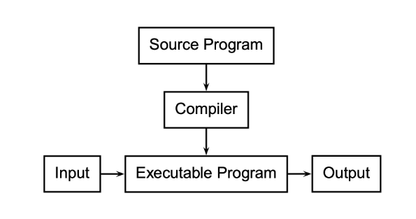
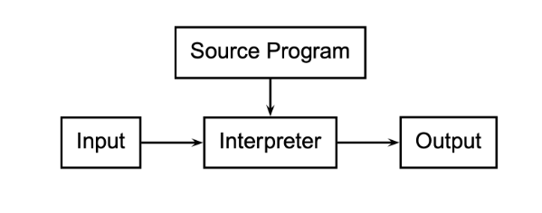
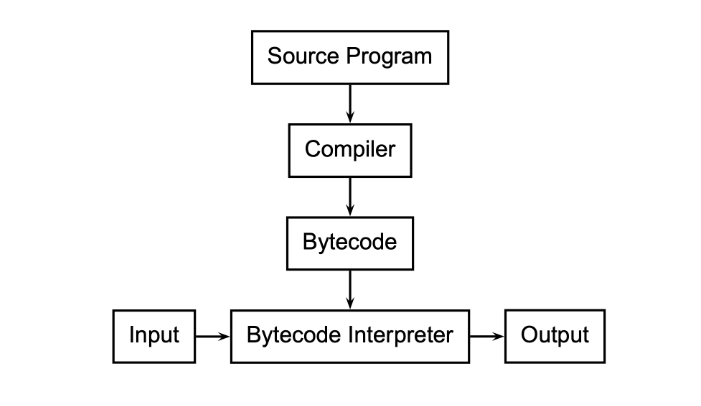
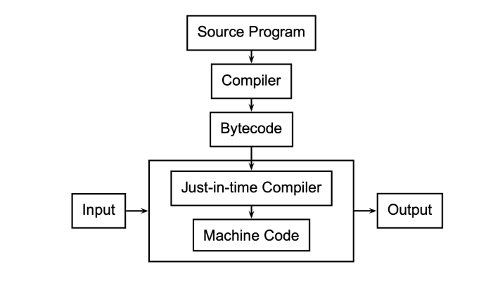
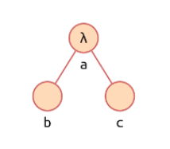
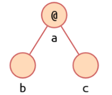

# Resum Final

Aquest resum es basa en les transparències de l'assignatura de LP de Jordi Petit.

---

## **1. λ-càlcul**

Afegir les fotos

---

## 2. Raonament equacional

Afegir les fotos

---

## 3. Elements de la Programació Funcional en C++

Afegir les fotos

---

## 4. Llenguatges de *scripting*

+ Un llenguatge de *scripting* (de guions) és un llenguatge de programació destinat a escriure programes que s'integrin i es comuniquin amb altres programes.

+ ### LSs *vs* LPs tradicionals:
  
     - Els LS estan pensats per crear aplicacions combinant components.
  
     - Desenvolupar amb LSs és de 5 a 10 vegades més ràpid.
  
     - Executar amb LSs és de 10 a 20 vegades més lent.
  
     - Els LS són normalment interpretats, amb compilació *just-in-time* o les dues.
  
     - Molts LSs són feblement tipats (Excepció: Python).
  
     - Molts LS tenen tipat dinàmic (Excepció: RPG).
- ### Compilació *just-in-time
  
     - Es compila el codi en temps d'execució (a codi màquina o a algun tipus de bytecode).
  
     - Pot aplicar **optimizacions** que depenen del context d'execució.
       
          - :white_check_mark: el codi resultant pot ser molt més eficient.
       
          - :x: la compilació en execució és ineficient.
  
     - Es pot aplicar parcialment: només en certes construcions
       
       Per exemple: expressions regulars (matching).
  
     - Pot combinar-se amb la compilació (estàtica) a **bytecode**:
       
          - Primer es compila el llenguatge a bytecode.
          - S'aplica JIT al bytecode per obtenir codi màquina més eficient.

- ### Característiques principals del LSs
  
     - Permeten tant ús en batch com interactiu.
  
     - La majoria tracten l'entrada línia a línia.
       
       > :exclamation: Perl és dels pocs que usen un compilador just-in-time que requereix llegir tot el programa abans de tractar-lo.
  
     - Altres accepten instruccions per línia de comandes (ex: Rexx, Python, Tcl i Ruby).
       
          + Han de poder ser interpretats (sense compilació just-in-time).
       
          + Python, Tcl i Ruby admeten les dues possibilitats.
  
     - Absència de declaracions. Regles simples d'establiment d'àmbit (*scoping*).
  
     - Declaracions:
       
          - En molts LS no hi ha declaracions.
            
               - Per exemple, l'assignació dóna el tipus.
       
          - Àmbit:
            
               - En alguns tot és global per defecte (Perl).
               - En alguns tot és local per defecte (PHP, Tcl).
               - Pot haver-hi regles com ara que l'assignació defineix la localitat.
  
     - **Tipat dinàmic flexible**: Relacionat amb l'absència de declaracions, la majoria dels LS són tipats dinàmicament.
       
          - En alguns, el tipus d'una variable es comprova just abans de ser usada. Ex: PHP, Python, Ruby.
       
          - En altres es pot interpretar diferent en diferents àmbits. Ex: Rexx, Perl, Tcl.
  
     - **Fàcil comunicació amb altres programes**: Donen moltes opcions predefinides per executar programes o operacions directament sobre el SO.
  
     - Pattern matching i manipulació de strings sofisticada:
       
          - Tendeixen a tenir facilitats molt riques per fer pattern matching, cerca i manipulació de strings.
  
     - Tipus de dades d'alt nivell
       
          - S'inclouen com predefinits tipus d'alt nivell com ara: sets, bags, maps, lists, tuples,...
       
          - No es troben en llibreries, sinó que fan part del llenguatge.
       
          - Per exemple, és habitual tenir arrays indexats per strings com part del llenguatge (que s'implementen amb taules de hash).
       
          - S'utilitzen *garbagge collectors* per gestionar l'espai.

- ### Dominis d'aplicació
  
     - Llenguatges de comandes shell: (bash, ...)
  
     - Processament de textos i generació d'informes: (sed, awk, Perl, ...)
  
     - Matemàtiques i estadística: (Matlab, R, ...)
  
     - Scripting de propòsit general: (Perl, Tcl, Python, Ruby)
  
     - Llenguatges d'extensió: són llenguatges de scripting que permeten fer scripts per una determinada aplicació: (Visual Basic, Apple Script, ...)
  
     - Web scripting: (Perl, PHP, Python, JavaScript, Cold Fusion, ...)

---

## 5. Introducció a la compilació

### Processadors de llenguatges

#### Compiladors

Un **compilador** és un programa que tradueix programes escrits en un *LP* d'alt nivell a codi màquina (o, en general, a codi de baix nivell).



#### Intèrprets

Un **intèrpret** és un programa que executa directament instruccions escrites en un *LP*.



#### Intèrprets de *bycode*

Variant entre els compiladors i els intèrprets.

- El ***bytecode*** és un codi intermedi més abstracte que el codi màquina.
- Augmenta la portabilitat i seguretat i facilita la interpretació.
- Una **màquina virtual** interpreta programes en *bytecode*.



#### Compiladors *just-in-time*

La compilació ***just-in-time*** compila fragments del programa durant la seva execució.

Un analitzador inspecciona el codi executat per veure quan val la pena compilar-lo.



#### Preprocessadors

Un **preprocessador** prepara el codi font d'un programa abans que el compilador el vegi.

- Expansió de *macros*
- Inclusió de fitxers
- Compilació condicional
- Extensions de llenguatge

### Sintaxi

La **sintaxi** d'un llenguatge de programació és el conjunt de regles que defineixen les combinacions de símbols que es consideren construccions correctament estructurades. Sovint s'especifica la sintaxi utilitzant una **gramàtica lliure de context** (*context-free grammar*).

Els elements més bàsics ("paraules") s'especifiquen a través d'**expressions regulars**. Aquí podem veure una sintaxi definida en *antlr*

```antlr4
expr → NUM
     | '(' expr ')'
     | expr '+' expr
     | expr '-' expr
     | expr '*' expr
     | expr '/' expr
NUM  → [0-9]+ ( '.' [0-9]+ )
```

### Semàntica

La **semàntica** d'un *LP* descriu què significa un programa ben construït. A vegades, les construccions sintàcticament correctes poden ser semànticament incorrectes.

> ```java
> class Foo {
>     int bar(int x) { return Foo; }
> }
> ```
> 
> Això és sintàcticament correcte en Java, però sense sentit (semàntica).

Hi ha bàsicament dues maneres d'especificar formalment la semàntica:

- **Semàntica operacional:** defineix una màquina virtual i com l'execució del programa canvia l'estat de la màquina.

- **Semàntica denotacional:** mostra com construir una funció que representa el comportament del programa (és a dir, una transformació d'entrades a sortides) a partir de les construccions del *LP*.

La majoria de definicions de semàntica per a *LPs* utilitzen una semàntica operacional descrita informalment en llenguatge natural.

### Flux de compilació

**Etapes:**

- ***Front end*:**
     - **Preprocessador**
     - L'**analitzador lèxic** (**escàner**) agrupa els caràcters en "paraules" (*tokens*) i elimina blancs i comentaris.
     - L'**analitzador sintàctic** (**parser**) construeix un **arbre de sintaxi abstracta** (***AST***) a partir de la seqüència de *tokens* i les regles sintàctiques.
     - L'**analitzador semàntic** recorre l'*AST* i:
          - crea la **taula de símbols**,
          - assigna memòria a les variables,
          - comprova errors de tipus,
          - resol ambigüitats.
- ***Middle end*** :arrow_right: tradueix el programa a **codi de tres adreces** (ensamblador idealitzat amb infinitat de registres).
     - analitzador de codi intermedi
     - optimitzador de codi intermedi
- ***Back end*** :arrow_right: tradueix i optimitza el codi de tres adreces a l'**arquitectura desitjada**
     - generador de codi específic
     - optimitzador de codi específic

### Eines

Per construir un compilador no es parteix de zero. Hi ha moltes eines que donen suport:

- **ANTLR**: donades les especificacions lèxiques i sintàctiques del *LP*, construeix automàticament **l’escàner**, **l’analitzador** i **l'AST**.

- **LLVM**: ofereix una col·lecció d'eines modulars reutilitzables pels backends dels compiladors.

---

## 6. Inferència de tipus

> La **inferència de tipus** és la detecció automàtica dels tipus de les expressions en un llenguatge de programació.

### **Algorisme de *Milner*:**

> Permet computar el tipus més general en temps lineal.

+ Generem **arbre de sintaxi.**

+ Etiquetem nodes amb un tipus (si es conegut) o amb una variable.

+ Generem les **restriccions** amb les variables i tipus.

+ Solucionem les equacions.

+ **Formula de l'abstracció**: 

 `a = b -> c`

+ **Formula de l'aplicació**: 

 `b = c -> a`

### Definicions

> Podem entendre una definició com una funció que, aplicada als paràmetres, torna la part dreta de la definició

```haskell
map f l = if null l then [] else f (head l) : map f (tail l)
```

Aquesta definició de `map` és una funció que quan s'aplica sobre `f` i `l` retorna la funció:

```haskell
\f -> \l -> if null l then [] else f (head l) : map f (tail l)
```
